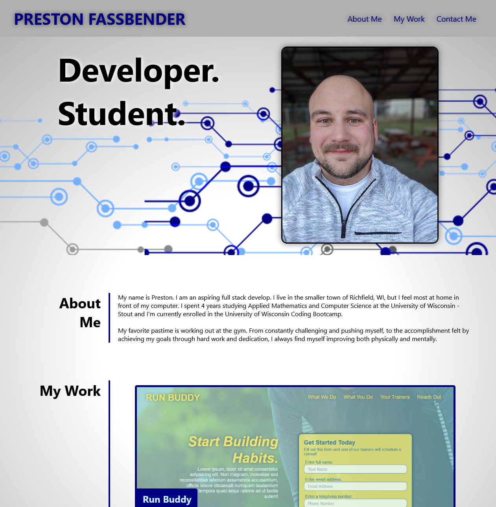

# An Online Portfolio - Preston Fassbender

The aim of this project was to create a personal online portfolio showcasing some of my work samples so potential employers can review those samples and assess whether I'm a good candidate for an open position.

## Technologies Used
* HTML 5
* CSS

with a focus on flexbox, media queries, and css variables

---

---

## The following is a link to the live website.
https://p-fassbender.github.io/personal-portfolio/
